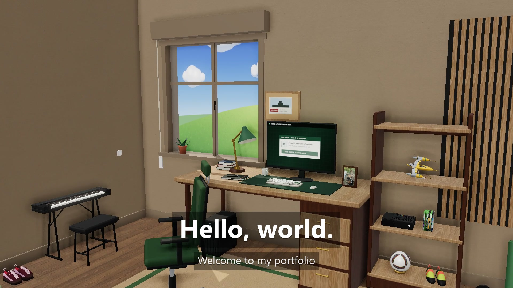
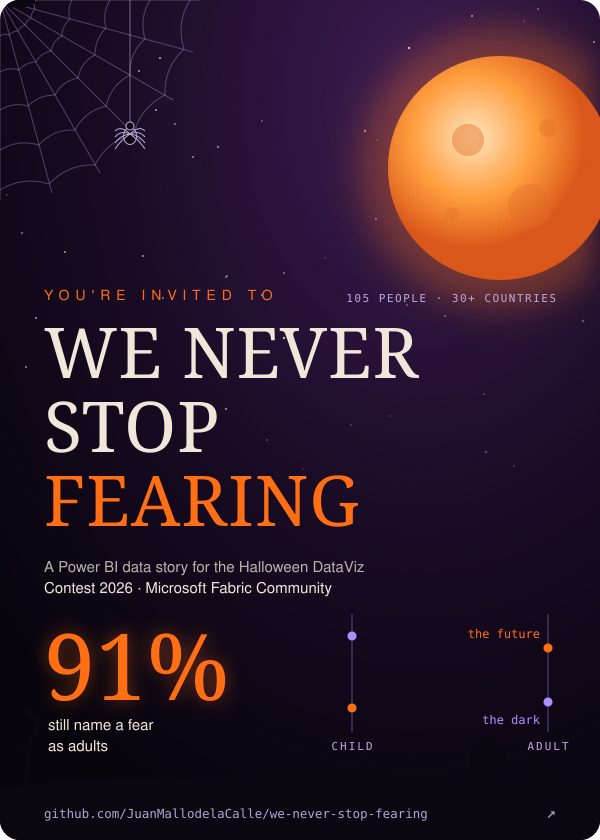

<a href="https://juanos.pages.dev">
<picture>
  <source media="(max-width: 700px)" srcset="assets/header-mobile.svg">
  
</picture>
</a>

  
  
  
  
  

 

## 🏠 &nbsp;Welcome to JuanOS

My portfolio is a room you can walk into. **JuanOS** is a 3D bedroom whose light follows your local time. Sit at the desk and the computer boots a small OS about me: my research, a travel gallery, a chess game against three versions of me and a terminal that hides a secret. 14 achievements, plus one hidden.

Built with TypeScript, React, Vite and Three.js, with Claude Code as a development partner.

<b><a href="https://juanos.pages.dev">→ &nbsp;Boot JuanOS at juanos.pages.dev</a></b>

 

## 🔬 &nbsp;Research: DREAM

**DREAM: A Multicultural Multimodal Dataset Linking Dialogues and Realistic Image Sequences** 
Juan Mallo de la Calle, Marcos Estecha-Garitagoitia, Ricardo Córdoba, Luis Fernando D'Haro · *LREC 2026*

<a href="https://github.com/JuanMallodelaCalle/personalized-ai-visual-summaries">
<picture>
  <source media="(max-width: 700px)" srcset="assets/dream-mobile.svg">
  
</picture>
</a>

  
  
  
  
  
  
   Six of the 2,000 DREAM portraits. All fully synthetic: no real person is depicted.

Long, persona-driven conversations are hard to review. DREAM turns them into storyboards: 1,000 dialogues from PersonaChat and ComperDial, each enriched with two multicultural persona profiles, a photorealistic portrait per speaker and a sequence of scene images for the moments that matter. It started as my Master's thesis at UPM and supports research on visual grounding of dialogue, identity consistency and bias in generated images.

| | |
| :--- | :--- |
| 📄&nbsp;**Paper** | [LREC 2026 Proceedings](https://lrec.elra.info/lrec2026-main-728) |
| 📊&nbsp;**Scale** | 1,000 dialogues · 2,000 personas and portraits · 6,950 scene images |
| 🤗&nbsp;**Dataset** | [JuanMallo/dream-75pct](https://huggingface.co/datasets/JuanMallo/dream-75pct): a 75% public subset |
| ⚙️&nbsp;**Pipeline** | [personalized-ai-visual-summaries](https://github.com/JuanMallodelaCalle/personalized-ai-visual-summaries): generation and evaluation pipeline (LLMs, VLMs, text-to-image, human and VLM evaluation) |
| 🧬&nbsp;**Explorer** | [dream-persona-explorer](https://github.com/JuanMallodelaCalle/dream-persona-explorer): Streamlit dashboard to filter, map and quality-check the 2,000 personas |

<b>See the persona explorer in action</b>

 

 

## 🧪 &nbsp;Projects

  
  

  
  

  
  

<b>All public repositories</b>

 

| Project | What it is | Built with |
| :--- | :--- | :--- |
| [personalized-ai-visual-summaries](https://github.com/JuanMallodelaCalle/personalized-ai-visual-summaries) | Official DREAM repository: the pipeline that turns dialogues into personas, portraits and scene sequences, plus human and VLM evaluation. LREC 2026. | LLM / VLM APIs, text-to-image, Gradio |
| [dream-persona-explorer](https://github.com/JuanMallodelaCalle/dream-persona-explorer) | Streamlit dashboard to filter, map and quality-check the 2,000 synthetic DREAM personas. | Streamlit, Plotly, pandas |
| [agentic-portfolio-rag-langgraph](https://github.com/JuanMallodelaCalle/agentic-portfolio-rag-langgraph) | Local agentic RAG assistant over my portfolio: grounded Q&A, project picks and job-fit summaries. | LangGraph, LangChain, Ollama, Chroma |
| [xai-covid-cxr-tabular-image](https://github.com/JuanMallodelaCalle/xai-covid-cxr-tabular-image) | Bias-aware XAI on COVID-19 chest X-rays and clinical metadata. | Random Forest, XGBoost, CNN, SHAP, LIME, Grad-CAM |
| [we-never-stop-fearing](https://github.com/JuanMallodelaCalle/we-never-stop-fearing) | One-page A4 poster for the Fabric Community Halloween DataViz Contest 2026, WCAG 2.2 AA. | Power BI, DAX |
| [sf-taxi-ev-mobility-analysis](https://github.com/JuanMallodelaCalle/sf-taxi-ev-mobility-analysis) | Electric-fleet planning from San Francisco taxi GPS traces: stops, charging windows, energy demand. | pandas, Folium |
| [polygon-ga-image-evolution](https://github.com/JuanMallodelaCalle/polygon-ga-image-evolution) | Genetic algorithm that evolves images from translucent polygons, with perceptual metrics. | NumPy, CIE76 ΔE*, SSIM, LPIPS, FID |
| [RLCms](https://github.com/JuanMallodelaCalle/RLCms) | Bachelor's thesis: self-play RL chess agent, built on Arjan Groen's open-source RL Chess. Supervised by Rubén San Segundo Hernández. | python-chess, MCTS, CNNs, Stockfish 16.1 |

 

## 🧰 &nbsp;Toolbox

<table width="100%">
<tr>
  <td nowrap><b>Languages</b></td>
  <td>&nbsp;Python &nbsp; &nbsp;R &nbsp; &nbsp;SQL &nbsp; &nbsp;MATLAB &nbsp; &nbsp;TypeScript</td>
</tr>
<tr>
  <td nowrap><b>ML</b></td>
  <td>&nbsp;PyTorch &nbsp; &nbsp;TensorFlow &nbsp; &nbsp;scikit-learn &nbsp; &nbsp;XGBoost</td>
</tr>
<tr>
  <td nowrap><b>GenAI</b></td>
  <td>&nbsp;Hugging Face &nbsp; &nbsp;LangChain &nbsp; &nbsp;LangGraph &nbsp; &nbsp;Ollama &nbsp; &nbsp;OpenAI &nbsp; &nbsp;Claude Code</td>
</tr>
<tr>
  <td nowrap><b>Data &amp; BI</b></td>
  <td>&nbsp;pandas &nbsp; &nbsp;NumPy &nbsp; &nbsp;Jupyter &nbsp; &nbsp;Streamlit &nbsp; &nbsp;Power BI</td>
</tr>
<tr>
  <td nowrap><b>Web &amp; 3D</b></td>
  <td>&nbsp;React &nbsp; &nbsp;Three.js &nbsp; &nbsp;Vite</td>
</tr>
<tr>
  <td nowrap><b>Tools</b></td>
  <td>&nbsp;Git &nbsp; &nbsp;GitHub</td>
</tr>
</table>

 

## 🎓 &nbsp;Education

- **MSc in Signal Theory and Communications**, Signal Processing & ML for Big Data · Universidad Politécnica de Madrid
- **BSc in Data Engineering and Systems** · Universidad Politécnica de Madrid
- **Erasmus exchange** · Warsaw University of Technology

 

<a href="https://www.chess.com/member/juanmallo">
<picture>
  <source media="(prefers-color-scheme: dark) and (max-width: 700px)" srcset="assets/footer-dark-mobile.svg">
  <source media="(max-width: 700px)" srcset="assets/footer-light-mobile.svg">
  <source media="(prefers-color-scheme: dark)" srcset="assets/footer-dark.svg">
  
</picture>
</a>
